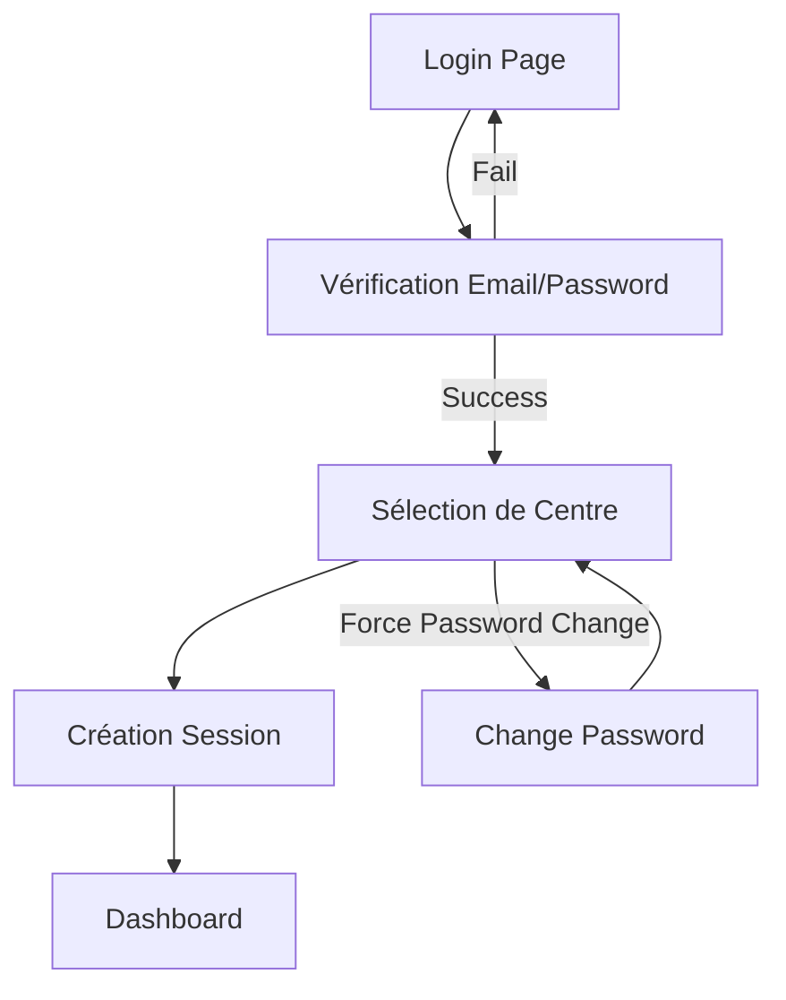

# Documentation - Système d'Authentification et Attributs

## Table des Matières

1. [Vue d'Ensemble](#vue-densemble)
2. [Architecture des Rôles](#architecture-des-rôles)
3. [Système d'Authentification](#système-dauthentification)
4. [Attributs d'Autorisation](#attributs-dautorisation)
   - [Attributs de Base](#attributs-de-base)
   - [Attributs Spécialisés](#attributs-spécialisés)
   - [Attributs Combinés](#attributs-combinés)
5. [Utilisation Pratique](#utilisation-pratique)
6. [Exemples d'Implémentation](#exemples-dimplémentation)
7. [Bonnes Pratiques](#bonnes-pratiques)
8. [Dépannage](#dépannage)

---

## Vue d'Ensemble

Le système d'authentification de HManagSys utilise une approche basée sur les **sessions HTTP personnalisées** combinée à des **attributs d'autorisation personnalisés** pour contrôler l'accès aux fonctionnalités selon les rôles utilisateur.

### Caractéristiques Principales

- ✅ **Authentification par sessions** (12 heures d'expiration)
- ✅ **Multi-centres** : Un utilisateur peut avoir des rôles différents selon le centre
- ✅ **Changement de centre** sans déconnexion
- ✅ **Attributs déclaratifs** pour les autorisations
- ✅ **Audit complet** de toutes les actions
- ✅ **Gestion des sessions actives**

---

## Architecture des Rôles

### Rôles Disponibles

| Rôle | Code | Description | Capacités |
|------|------|-------------|-----------|
| **Super Administrateur** | `SuperAdmin` | Administrateur système global | Toutes permissions + Gestion utilisateurs |
| **Personnel Soignant** | `MedicalStaff` | Médecins, infirmières, etc. | Gestion patients, ventes, soins |

### Hiérarchie des Rôles

```
SuperAdmin
    ├── Toutes les permissions de MedicalStaff
    ├── Gestion des utilisateurs
    ├── Configuration système
    ├── Accès multi-centres
    └── Rapports globaux

MedicalStaff
    ├── Gestion des patients
    ├── Soins et prescriptions
    ├── Ventes de produits
    ├── Consultation stocks
    └── Rapports de centre
```

### Affectations Multi-Centres

Un utilisateur peut avoir des rôles différents selon le centre :

```csharp
// Exemple : Dr. Martin
// - SuperAdmin au Centre Principal
// - MedicalStaff au Centre Nord
// - Pas d'accès au Centre Sud
```

---

## Système d'Authentification

### Workflow de Connexion



### Données de Session

Les informations suivantes sont stockées dans la session HTTP :

```csharp
// Données utilisateur
HttpContext.Session.SetInt32("UserId", user.Id);
HttpContext.Session.SetString("UserName", user.FullName);
HttpContext.Session.SetString("UserEmail", user.Email);

// Contexte actuel
HttpContext.Session.SetInt32("CurrentCenterId", centerId);
HttpContext.Session.SetString("CurrentCenterName", centerName);
HttpContext.Session.SetString("CurrentRole", roleInCenter);

// Session tracking
HttpContext.Session.SetString("SessionToken", sessionToken);
```

### Cycle de Vie des Sessions

- **Durée** : 12 heures d'inactivité
- **Prolongation** : Automatique à chaque requête
- **Nettoyage** : Sessions expirées supprimées automatiquement
- **Tracking** : Historique complet des connexions

---

## Attributs d'Autorisation

### Attributs de Base

#### `[RequireAuthentication]`

**Description** : Vérifie que l'utilisateur est connecté

```csharp
[RequireAuthentication]
public class DashboardController : Controller
{
    // Toutes les actions nécessitent une authentification
}
```

**Comportement** :
- Redirige vers `/Auth/Login` si non connecté
- Applicable sur contrôleurs ou actions
- Pas de paramètres

#### `[SuperAdmin]`

**Description** : Restreint l'accès aux SuperAdmins uniquement

```csharp
[SuperAdmin]
public async Task<IActionResult> UserManagement()
{
    // Seuls les SuperAdmins peuvent accéder
}
```

**Comportement** :
- Vérifie `CurrentRole == "SuperAdmin"`
- Retourne JSON pour AJAX, redirection pour vues
- Message d'erreur : "Accès refusé. Droits SuperAdmin requis."

#### `[MedicalStaff]`

**Description** : Permet l'accès au personnel médical ET aux SuperAdmins

```csharp
[MedicalStaff]
public async Task<IActionResult> PatientList()
{
    // SuperAdmin ET MedicalStaff peuvent accéder
}
```

**Comportement** :
- Vérifie `CurrentRole` in `["MedicalStaff", "SuperAdmin"]`
- SuperAdmin hérite automatiquement des permissions MedicalStaff

### Attributs Spécialisés

#### `[RequireRole(string role)]`

**Description** : Attribut générique pour vérifier un rôle spécifique

```csharp
[RequireRole("SuperAdmin")]
public async Task<IActionResult> SystemConfig()
{
    // Équivalent à [SuperAdmin] mais paramétrable
}

[RequireRole(new[] { "SuperAdmin", "MedicalStaff" })]
public async Task<IActionResult> AccessibleByBoth()
{
    // Accès multiple rôles
}
```

**Paramètres** :
- `role` : Rôle requis (string)
- `roles` : Tableau de rôles acceptés (string[])
- `redirectAction` : Action de redirection (défaut: "Index")
- `redirectController` : Contrôleur de redirection (défaut: "Dashboard")

#### `[PreventSelfAction]`

**Description** : Empêche un utilisateur d'agir sur lui-même

```csharp
[SuperAdmin]
[PreventSelfAction]
public async Task<IActionResult> DeactivateUser(int userId)
{
    // Empêche de se désactiver soi-même
}
```

**Paramètres** :
- `userIdParameterName` : Nom du paramètre contenant l'ID utilisateur (défaut: "userId")

**Comportement** :
- Compare `CurrentUserId` avec le paramètre fourni
- Bloque l'action si identiques
- Message : "Vous ne pouvez pas effectuer cette action sur votre propre compte."

#### `[RequireCenterAccess]`

**Description** : Vérifie l'accès à un centre spécifique

```csharp
[RequireCenterAccess("centerId")]
public async Task<IActionResult> CenterReport(int centerId)
{
    // Vérifie l'accès au centre demandé
}
```

**Paramètres** :
- `centerIdParameterName` : Nom du paramètre contenant l'ID du centre

**Comportement** :
- SuperAdmin : Accès à tous les centres
- Autres : Vérification de l'accès au centre spécifique
- Compare `CurrentCenterId` avec le paramètre fourni

#### `[RequireCurrentCenter]`

**Description** : S'assure qu'un centre est sélectionné

```csharp
[RequireCurrentCenter]
public class StockController : Controller
{
    // Toutes les actions nécessitent un centre sélectionné
}
```

**Comportement** :
- Vérifie `CurrentCenterId` non null
- Redirige vers `/Auth/SelectCenter` si aucun centre
- Utile pour les opérations liées à un centre spécifique

### Attributs Combinés

#### `[AdminUserAction]`

**Description** : Combinaison pour actions administratives sur utilisateurs

```csharp
[AdminUserAction]
public async Task<IActionResult> ResetPassword(int userId)
{
    // Vérifie : SuperAdmin + pas sur soi-même + authentification
}
```

**Équivalent à** :
```csharp
[RequireAuthentication]
[SuperAdmin]
[PreventSelfAction]
```

#### `[StockAction]`

**Description** : Gestion des permissions stock

```csharp
[StockAction(requiresSuperAdmin: true)]
public async Task<IActionResult> AdjustStock(int productId, decimal quantity)
{
    // Ajustement - SuperAdmin requis
}

[StockAction(requiresSuperAdmin: false)]
public async Task<IActionResult> SellProduct(int productId, decimal quantity)
{
    // Vente - Personnel médical autorisé
}
```

**Paramètres** :
- `requiresSuperAdmin` : true pour ajustements, false pour utilisations

**Inclut** :
- Vérification authentification
- Vérification centre sélectionné
- Vérification rôle selon paramètre

---

## Utilisation Pratique

### Sur un Contrôleur Complet

```csharp
[RequireAuthentication]
[RequireCurrentCenter]
public class PatientController : BaseController
{
    [MedicalStaff]
    public async Task<IActionResult> Index()
    {
        // Liste patients - accessible au personnel médical
    }

    [MedicalStaff]
    public async Task<IActionResult> Create()
    {
        // Créer patient
    }

    [SuperAdmin]
    public async Task<IActionResult> AdminPatientList()
    {
        // Vue admin des patients - SuperAdmin only
    }
}
```

### Sur des Actions Spécifiques

```csharp
public class ReportsController : BaseController
{
    [MedicalStaff]
    public async Task<IActionResult> CenterReport()
    {
        // Rapport du centre actuel
    }

    [SuperAdmin]
    public async Task<IActionResult> GlobalReport()
    {
        // Rapport global - SuperAdmin only
    }

    [RequireCenterAccess("centerId")]
    public async Task<IActionResult> SpecificCenterReport(int centerId)
    {
        // Rapport d'un centre spécifique
        // Vérifie l'accès au centre demandé
    }
}
```

### Actions AJAX

Les attributs gèrent automatiquement les réponses AJAX :

```csharp
[SuperAdmin]
[HttpPost]
[ValidateAntiForgeryToken]
public async Task<IActionResult> DeleteUser(int userId)
{
    try
    {
        // Logique métier
        return Json(new { success = true });
    }
    catch (Exception ex)
    {
        return Json(new { success = false, message = ex.Message });
    }
}
```

**Réponse automatique si non autorisé** :
```json
{
    "success": false,
    "message": "Accès refusé. Droits SuperAdmin requis."
}
```

---

## Exemples d'Implémentation

### Contrôleur Admin Complet

```csharp
[RequireAuthentication]
public class AdminController : BaseController
{
    [SuperAdmin]
    public async Task<IActionResult> Index()
    {
        // Dashboard admin
    }

    [SuperAdmin]
    public async Task<IActionResult> CreateUser()
    {
        // Formulaire création utilisateur
    }

    [SuperAdmin]
    [HttpPost]
    public async Task<IActionResult> CreateUser(CreateUserViewModel model)
    {
        // Traitement création
    }

    [SuperAdmin]
    public async Task<IActionResult> EditUser(int id)
    {
        // Formulaire édition
    }

    [AdminUserAction] // SuperAdmin + PreventSelfAction
    [HttpPost]
    public async Task<IActionResult> ResetPassword(int userId)
    {
        // Reset password
    }

    [AdminUserAction] // SuperAdmin + PreventSelfAction  
    [HttpPost]
    public async Task<IActionResult> ToggleUserStatus(int userId, bool isActive)
    {
        // Activer/désactiver utilisateur
    }
}
```

### Contrôleur Stock avec Permissions Fines

```csharp
[RequireAuthentication]
[RequireCurrentCenter]
public class StockController : BaseController
{
    [MedicalStaff]
    public async Task<IActionResult> Index()
    {
        // Vue stock - lecture pour tous
    }

    [SuperAdmin]
    public async Task<IActionResult> InitialStock()
    {
        // Configuration stock initial
    }

    [StockAction(requiresSuperAdmin: true)]
    [HttpPost]
    public async Task<IActionResult> AddStock(StockEntryModel model)
    {
        // Entrée de stock - SuperAdmin only
    }

    [StockAction(requiresSuperAdmin: true)]
    [HttpPost]
    public async Task<IActionResult> AdjustStock(StockAdjustmentModel model)
    {
        // Ajustement stock - SuperAdmin only
    }

    [StockAction(requiresSuperAdmin: false)]
    [HttpPost]
    public async Task<IActionResult> RecordSale(SaleModel model)
    {
        // Vente - décrémente stock - Personnel médical
    }

    [StockAction(requiresSuperAdmin: false)]
    [HttpPost]
    public async Task<IActionResult> RecordCareUsage(CareProductUsageModel model)
    {
        // Utilisation pour soins - Personnel médical
    }
}
```

### Gestion Multi-Centres

```csharp
[RequireAuthentication]
public class MultiCenterController : BaseController
{
    [SuperAdmin]
    public async Task<IActionResult> GlobalDashboard()
    {
        // Vue globale - SuperAdmin peut voir tous les centres
    }

    [MedicalStaff]
    [RequireCurrentCenter]
    public async Task<IActionResult> CurrentCenterData()
    {
        // Données du centre actuel seulement
    }

    [RequireCenterAccess("centerId")]
    public async Task<IActionResult> SpecificCenterData(int centerId)
    {
        // Données d'un centre spécifique
        // SuperAdmin : tous les centres
        // MedicalStaff : seulement ses centres assignés
    }

    [SuperAdmin]
    [HttpPost]
    public async Task<IActionResult> TransferStock(int fromCenterId, int toCenterId, TransferModel model)
    {
        // Transfert inter-centres - SuperAdmin only
    }
}
```

---

## Bonnes Pratiques

### 1. Ordre des Attributs

```csharp
// ✅ Bon ordre
[RequireAuthentication]      // 1. Auth générale
[RequireCurrentCenter]       // 2. Contraintes contextuelles
[SuperAdmin]                 // 3. Rôle spécifique
[PreventSelfAction]          // 4. Contraintes métier
[HttpPost]                   // 5. Attributs HTTP
[ValidateAntiForgeryToken]   // 6. Sécurité CSRF
public async Task<IActionResult> Action(int id) { }
```

### 2. Placement des Attributs

```csharp
// ✅ Sur le contrôleur pour rules communes
[RequireAuthentication]
[RequireCurrentCenter]
public class PatientController : BaseController
{
    // ✅ Sur l'action pour rules spécifiques
    [SuperAdmin]
    public async Task<IActionResult> AdminView() { }
    
    // ✅ Tous héritent de RequireAuthentication + RequireCurrentCenter
    [MedicalStaff]
    public async Task<IActionResult> StandardView() { }
}
```

### 3. Messages d'Erreur Cohérents

```csharp
// Les attributs gèrent automatiquement les messages
// Mais vous pouvez les personnaliser si nécessaire

[RequireRole("SuperAdmin", redirectController: "Home")]
public async Task<IActionResult> SpecialAction()
{
    // Redirection personnalisée vers Home au lieu de Dashboard
}
```

### 4. Combinaison d'Attributs

```csharp
// ✅ Utilisez les attributs combinés pour les cas fréquents
[AdminUserAction] // Au lieu de [SuperAdmin] + [PreventSelfAction]

// ✅ Ou créez vos propres combinaisons
[StockAction(requiresSuperAdmin: true)] // Au lieu de plusieurs attributs
```

### 5. Testing des Permissions

```csharp
// Les attributs facilitent les tests
[Test]
public void SuperAdmin_CanAccess_AdminActions()
{
    // Tester avec CurrentRole = "SuperAdmin"
    var result = controller.AdminAction();
    Assert.IsType<ViewResult>(result);
}

[Test]
public void MedicalStaff_CannotAccess_AdminActions()
{
    // Tester avec CurrentRole = "MedicalStaff"
    var result = controller.AdminAction();
    Assert.IsType<RedirectToActionResult>(result);
}
```

---

## Dépannage

### Problèmes Courants

#### 1. "Accès refusé" inattendu

**Symptômes** : L'utilisateur a le bon rôle mais l'accès est refusé

**Causes possibles** :
- Session expirée
- Centre non sélectionné
- Confusion entre IDs utilisateur/centre

**Debug** :
```csharp
// Ajoutez logging dans vos actions
_logger.LogInformation($"User: {CurrentUserId}, Role: {CurrentRole}, Center: {CurrentCenterId}");
```

#### 2. Redirections infinies

**Symptômes** : L'application boucle entre pages

**Causes** :
- Attribut `[RequireAuthentication]` sur la page de login
- Centre requis mais pas de mécanisme de sélection

**Solution** :
```csharp
// ❌ Évitez sur AuthController
[RequireAuthentication]
public class AuthController : Controller
{
    // ✅ Actions publiques sans attributs
    public IActionResult Login() { }
}
```

#### 3. AJAX ne respecte pas les attributs

**Vérifications** :
- Token CSRF présent
- Headers corrects pour détection AJAX
- Gestion des réponses JSON côté client

### Debug des Attributs

```csharp
// Ajoutez logs dans vos attributs personnalisés
public override void OnActionExecuting(ActionExecutingContext context)
{
    var userId = context.HttpContext.Session.GetInt32("UserId");
    var role = context.HttpContext.Session.GetString("CurrentRole");
    
    _logger.LogDebug($"Attribute check - User: {userId}, Role: {role}");
    
    base.OnActionExecuting(context);
}
```

### Monitoring des Sessions

```csharp
// Service pour surveiller les sessions actives
public class SessionMonitoringService
{
    public async Task<List<ActiveSession>> GetActiveSessionsAsync()
    {
        // Retourner la liste des sessions actives
        // Utile pour détecter les problèmes d'authentification
    }
}
```

---

## Conclusion

Le système d'attributs personnalisés de HManagSys offre :

- ✅ **Sécurité renforcée** par des contrôles automatiques
- ✅ **Code plus propre** sans vérifications manuelles répétitives
- ✅ **Maintenabilité** avec logique centralisée
- ✅ **Flexibilité** pour des cas d'usage spécifiques
- ✅ **Évolutivité** pour de nouveaux rôles ou permissions

Cette approche combine la puissance des attributs ASP.NET Core avec la logique métier spécifique d'un système hospitalier multi-centres, créant une solution robuste et facile à maintenir.